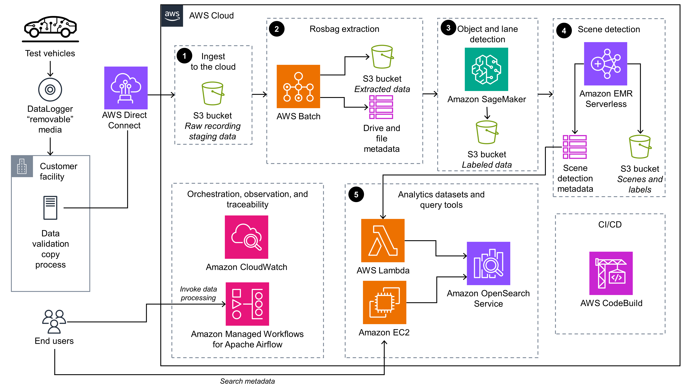

# Scene Intelligence with Rosbag on AWS

## Overview

Scene Intelligence with Rosbag on AWS provides an end-to-end solution for extracting sensor data from rosbag files generated from autonomous driving use cases. It guides users through a sample use case demonstrating the processing of sensor data and the application of custom logic to the extracted data. This solution enables users to stage sample rosbag files, extract sensor data, apply object detection and lane detection models, and store the processed data in an indexable fashion using Amazon DynamoDB and Amazon OpenSearch Service.

## Key Features

- **Rosbag Data Extraction**: Extract sensor data such as metadata and images from rosbag files.
  
- **Model Application**: Apply object detection (YOLOv5) and lane detection (LaneDet) models to extracted images.
  
- **Business Logic Application**: Apply scene detection business logic to the extracted data and store the output in DynamoDB and OpenSearch Service.

## Target Audience

The intended audience for using this solution includes solution architects, business decision makers, DevOps engineers, data scientists, and cloud professionals.

## Architecture

### High-Level Process Flow

1. **Rosbag File Upload**: The Autonomous Vehicle (AV) uploads the rosbag file to Amazon S3.
  
2. **Workflow Invocation**: The end user triggers the processing workflow through Amazon Managed Workflows for Apache Airflow (MWAA) and a Directed Acyclic Graph (DAG).

3. **Data Processing**:
   - **AWS Batch**: Pulls the rosbag file from Amazon S3, parses and extracts sensor and image data, and writes the data to another S3 bucket.
   - **Amazon SageMaker**: Applies object detection and LaneDet models to the extracted data and writes the data and labels to another S3 bucket.
   - **Amazon EMR Serverless**: Applies business logic to the data and labels, generating metadata related to object detection and LaneDet. The metadata is written to DynamoDB and another S3 bucket.

4. **Data Querying**:
   - **AWS Lambda**: Publishes new DynamoDB data (metadata) to the OpenSearch Service cluster.
   - **Amazon EC2**: End users access the OpenSearch Service cluster through a proxy on Amazon EC2 to submit queries against the metadata.

### AWS Services Used

- **AWS Batch**: For extracting Apache Parquet and PNG files.
- **Amazon DynamoDB**: For tracking batch and metadata.
- **Amazon EMR Serverless**: For processing object detection and LaneDet outputs.
- **Amazon MWAA**: For orchestrating the workflow.
- **Amazon OpenSearch Service**: For advanced querying.
- **Amazon S3**: For staging rosbag files and intermediate artifacts.
- **Amazon SageMaker**: For running object detection and LaneDet jobs.
- **AWS CodeBuild**: For managing module deployments.
- **Amazon EC2**: For providing a secure proxy to the OpenSearch Dashboard.
- **Amazon ECR**: For building and storing container images.
- **AWS IAM**: For managing permissions.
- **AWS Lambda**: For loading data into OpenSearch Service.
- **AWS Systems Manager**: For secure access to the OpenSearch Dashboard.

## Configuration

The solution provides configuration files for customizing functionality, controls, security services, and networking topology.

