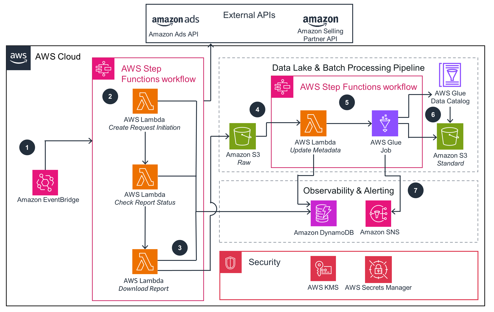

### Report Creation and Processing Workflow:

- **Amazon EventBridge**:
  - Schedules a job to start an AWS Step Functions state machine.
- **AWS Step Functions Workflow**:
  - Processes a series of AWS Lambda functions to create reports.
- **AWS Lambda - Create Request Initiation**:
  - Initiates a report request from Amazon Ads API or Amazon Selling Partner API.
  - API credentials stored in AWS Secrets Manager are used for API calls.
- **AWS Lambda - Check Report Status**:
  - Polls to check the status of the report request.
- **AWS Lambda - Download Report**:
  - Downloads the report after the request is completed.
  - Metadata for each report is stored in Amazon DynamoDB.
- **Lambda - Update Metadata**:
  - Stores the task token for Step Functions initiation ID in DynamoDB table.
- **AWS Glue Job**:
  - Transforms raw data from Amazon S3 bucket to usable format.
  - Writes transformed data to standard Amazon S3 bucket with AWS KMS encryption.
- **Amazon SNS**:
  - Sends notifications as new data is transformed into the standard Amazon S3 bucket.

    
