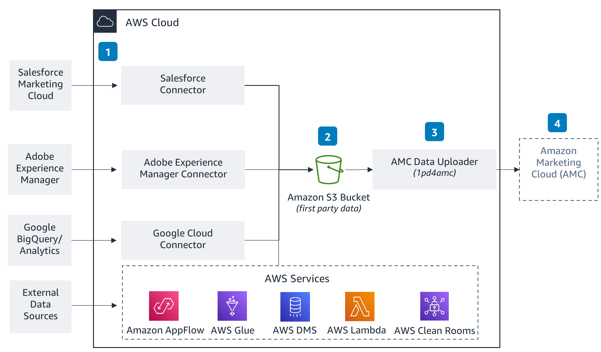

### Data Import and Transformation Process:

- **Data Import**:
  - Data from third-party services is brought into AWS using various methods such as pushing or pulling.
  - Native AWS services like Amazon AppFlow, AWS Glue, AWS Database Migration Service (AWS DMS), AWS Lambda, or AWS Clean Rooms are used for importing data.

- **Storage and Transformation**:
  - Imported data is stored in an Amazon Simple Storage Service (Amazon S3) bucket.
  - The data is normalized and transformed within the S3 bucket to prepare it for ingestion into Amazon Marketing Cloud (AMC).

- **AMC Data Uploader**:
  - An AMC Data Uploader tool is utilized to:
    - Create a dataset schema: Define the structure of the data to be uploaded.
    - Transform and normalize data: Prepare the data according to the defined schema.
    - Upload directly to AMC using the AMC API: Transfer the transformed data into AMC for further analysis.

- **Querying Data**:
  - Once the data is uploaded into AMC, it can be queried within the AMC user interface (UI) or programmatically via the AMC API.

## In Easy Words

- Third-party data is brought into AWS using services like Amazon AppFlow, AWS Glue, etc.
- The data is stored in Amazon S3 and processed to make it compatible with Amazon Marketing Cloud (AMC).
- The AMC Data Uploader tool is used to define the data structure, transform it, and upload it into AMC.
- Finally, the uploaded data can be queried within AMC for analysis through its UI or API.

## Context on How the Services are being used 

- **Amazon AppFlow**:
  - Facilitates data transfer between AWS and third-party applications.

- **AWS Glue**:
  - Prepares and transforms data for analysis, including schema discovery and mapping.

- **AWS DMS**:
  - Helps migrate databases to AWS and supports ongoing data replication.

- **AWS Lambda**:
  - Executes code for data processing and transformation.

- **AWS Clean Rooms**:
  - Provides a secure environment for processing sensitive data.

- **Amazon S3**:
  - Stores imported data and serves as a staging area for transformation.

- **Amazon Marketing Cloud (AMC)**:
  - Platform for analyzing and optimizing marketing campaigns.