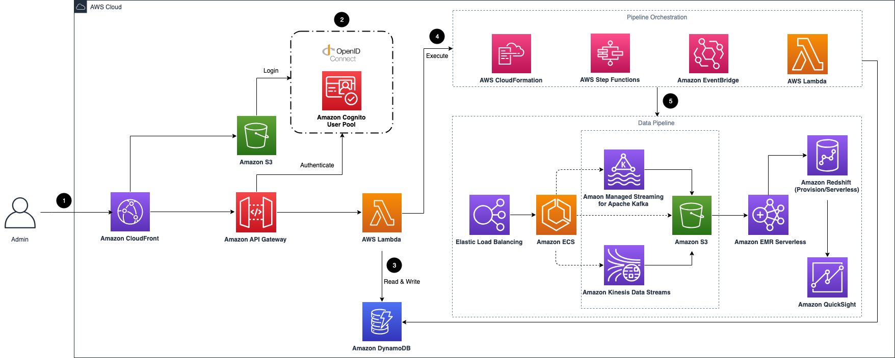
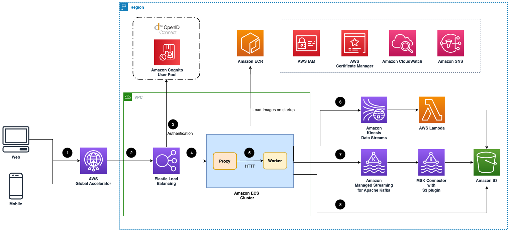
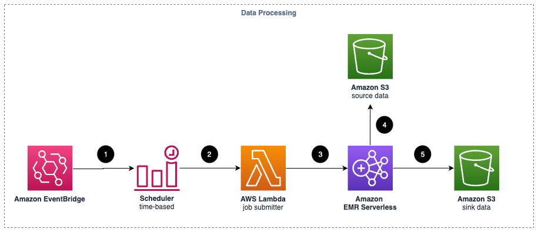
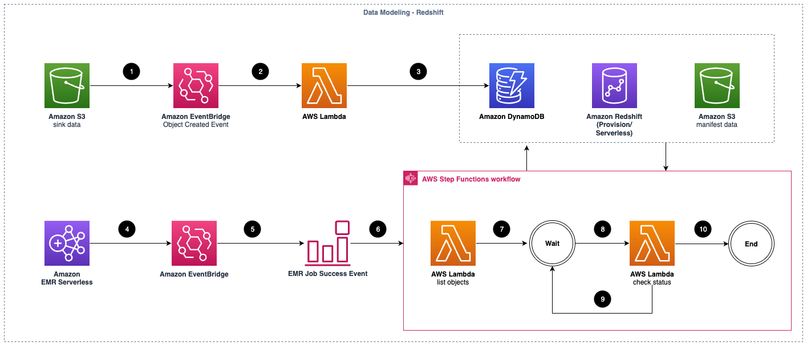

# Clickstream Analytics using AWS

The Clickstream Analytics on AWS solution helps businesses understand how users interact with their websites and mobile apps. It gathers data on what users click on, how they navigate through the site or app, and other behaviors. This data is valuable for improving business strategies.

With this solution, you can set up a system to collect, organize, process, and analyze this clickstream data. It's like having a toolkit that allows you to build your own analytics platform that suits your business needs perfectly. And the best part is, you have complete control over your data.

The solution comes with different tools and parts that you can mix and match to create your data pipeline quickly. It's like putting together LEGO pieces to build something cool. There are also special tools and instructions to help you gather data from different devices like Android phones, iPhones, and websites, and send it to Amazon Web Services (AWS) where it can be analyzed.

Once the data is in AWS, you can use pre-made dashboards and analysis tools to understand what the data is telling you. It's like having a set of easy-to-read reports that show you exactly what's happening with your users. This helps you make smart decisions to improve your website or app and make your business more successful.

## Benefits

The **Visual Data Pipeline Builder** is a user-friendly tool accessible through a web-based console. It simplifies the process of defining how your data flows through the system. You don't need to worry about setting up servers or dealing with complex security configurations - the solution handles all that for you. Each part of the data pipeline, called modules, is designed to work independently, giving you the flexibility to customize it for your specific needs.

**The Purpose-built SDKs** are specialized tools for gathering data from Android, iOS, and JavaScript platforms. They automatically capture common events like a user's first visit or when they view a screen. These SDKs also include features like local storage, retry mechanisms, and data verification, ensuring that the data transmission is reliable and complete.

With the **Out-of-the-box dashboard**, you get access to a variety of pre-made visualizations and reporting templates. These include graphs and charts for understanding user acquisition, engagement, retention, and demographics. These ready-to-use tools cover important areas like user behavior analysis, marketing effectiveness, and product performance, helping you make informed decisions for your business.

## Understanding the Architecture

**NOTE**:Image sourced from Amazon Web Services (AWS)

So Basically if you want to deploy this Architecture it deploys the AWS CloudFormation template in your AWS Cloud account and completes the following settings.

## Overview of the Architect

- **Amazon CloudFront**: Distributes frontend web UI assets from Amazon S3 and backend APIs from Amazon API Gateway and AWS Lambda.
- **Authentication**: Utilizes Amazon Cognito user pool or OpenID Connect (OIDC) for user authentication.
- **Amazon DynamoDB**: Stores persistent data for the web UI console.
- **Orchestration Tools**: AWS Step Functions, AWS CloudFormation, AWS Lambda, and Amazon EventBridge manage the lifecycle of data pipelines.
- **Data Pipeline Components**:
  - Application Load Balancer
  - Amazon ECS (Elastic Container Service)
  - Amazon Managed Streaming for Apache Kafka (Amazon MSK)
  - Amazon Kinesis Data Streams
  - Amazon S3
  - Amazon EMR Serverless
  - Amazon Redshift
  - Amazon QuickSight

## Ingestion Module

**Ingestion Module Architecture:**

- **Global Accelerator**: Speeds up event transmission from clients (like web or mobile apps) if enabled.
- **Elastic Load Balancing (ELB)**: Balances the load on ingestion web servers.
- **Authentication (Optional)**: If enabled, ALB communicates with the OIDC provider to verify requests.
- **Proxy and Worker Services**: Each ingestion server in Amazon ECS hosts a proxy and a worker service. The proxy manages HTTP communication, and the worker sends events to the chosen data sink.
- **Data Sink Options**:
  - If using Amazon Kinesis Data Streams or Amazon MSK, events are buffered and then sent to Amazon S3 in batches via AWS Lambda or MSK Connector.
  - If Amazon S3 is the sink, the ingestion server buffers events and sends them directly to S3.

**Data Processing Module Architecture:**

- **Event Triggering**: Amazon EventBridge triggers data processing jobs at set intervals.
- **Lambda Invocation**: A time-based scheduler triggers a Lambda function.
- **EMR Serverless Application**: Spark-based EMR Serverless processes batches of clickstream events, applying transformation and enrichment plugins.
- **Sinking Processed Data**: After processing, the data is sent to a designated S3 bucket.

**Data Modeling Module Architecture (Redshift):**

- **Event-Driven Process**: Upon clickstream data processing completion, an event triggers Lambda.
- **DynamoDB Interaction**: Lambda saves source events in DynamoDB for reference.
- **EMR Job Success Processing**: An Amazon EventBridge rule triggers AWS Step Functions workflow.
- **Manifest File Creation**: Step Functions workflow generates a manifest file for loading processed data into Redshift.
- **Status Monitoring**: Lambda checks loading job status until completion.

**Data Modeling Module Architecture (Athena):**

- **Periodic Data Load**: Amazon EventBridge schedules data loading into Amazon Athena.
- **Lambda Trigger**: A scheduled Lambda function creates partitions in the Glue table for processed clickstream data.
- **Interactive Querying**: Amazon Athena facilitates querying of clickstream events via the Glue table.

## Quick Notes

**Ingestion Module**:
- Optimize performance with Global Accelerator if latency is a concern.
- Ensure proper load balancing with Elastic Load  Balancing (ELB) for ingestion web servers.
- Consider enabling authentication for enhanced security if handling sensitive data.
- Regularly monitor and scale Amazon ECS cluster based on traffic and workload demands.
- Choose the appropriate data sink based on your specific use case and requirements.

**Data Processing Module**:
- Schedule data processing jobs at intervals suitable for your data volume and processing requirements.
- Utilize EMR Serverless for efficient and cost-effective batch processing of clickstream events.
- Implement comprehensive testing for transformation and enrichment plugins to ensure data accuracy.
- Monitor processing jobs and performance metrics to identify and address any bottlenecks or issues.