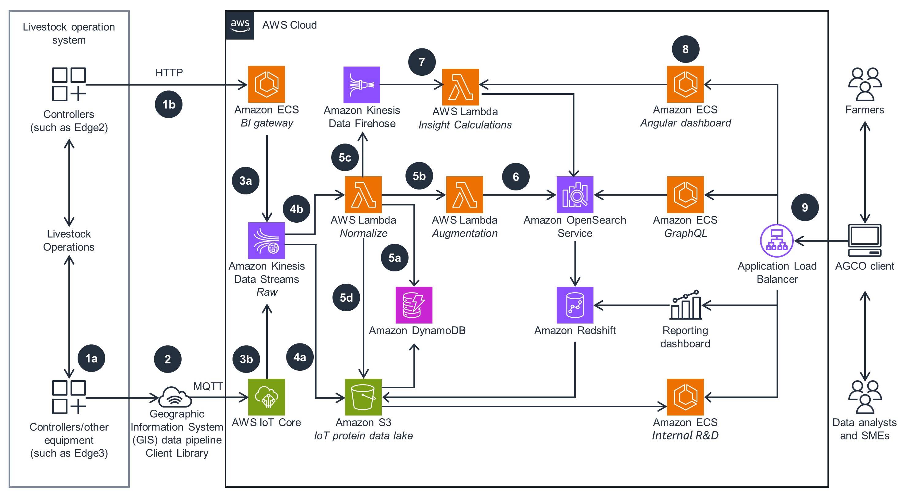

# Monitoring Livestock Health and Quality of Life on AWS

## Overview

This architecture demonstrates how to monitor livestock health and quality of life using AGCO's solutions on AWS, focusing on predicting healthy livestock feed requirements. AGCO is an international agriculture company specializing in professional farm machinery for various farming processes. The architecture involves collecting bird weight and feed bin data from load cell sensors, transmitting it to a central gateway controller and a business intelligence (BI) application running on Amazon Elastic Container Service (Amazon ECS), and processing and analyzing the data using AWS services.

## Architecture Components and Workflow

- **Data Collection**:
  - Bird weight and feed bin data from load cell sensors are transmitted to a central gateway controller.
  - Bird weight and feed bin data from other load cell sensors are transmitted directly to a BI application running on Amazon ECS through HTTP.

- **Data Transmission and Processing**:
  - The central gateway controller sends IoT sensor data to AWS IoT Core through MQTT.
  - BI application on Amazon ECS transmits sensor data to Amazon Kinesis Data Streams for consumption smoothing and further processing.
  - AWS IoT Core receives and decrypts sensor data, transmitting it to Kinesis Data Streams.
  - Kinesis Data Streams sends sensor data to an Amazon S3 data lake for long-term storage.
  - Kinesis Data Streams also sends data to an AWS Lambda function for enrichment and augmentation.

- **Data Enrichment and Storage**:
  - The Lambda function queries Amazon DynamoDB for operational data, enriches the data, and passes it to another Lambda function for further augmentation.
  - Enriched data is sent to Amazon Kinesis Data Firehose for storage and consumption.
  - Enriched data is also sent to Amazon S3 for research and development (R&D) or BI teams, made accessible through Amazon Redshift.

## Technologies Used

- **AWS IoT Core**: Receives and processes IoT sensor data.
- **Amazon ECS**: Hosts the BI application for data processing.
- **Amazon Kinesis Data Streams**: Handles real-time data ingestion and streaming.
- **Amazon S3**: Stores raw and enriched data for long-term storage.
- **AWS Lambda**: Enriches and augments sensor data for further analysis.
- **Amazon DynamoDB**: Stores operational data for enrichment.
- **Amazon Kinesis Data Firehose**: Streams enriched data to storage destinations.
- **Amazon Redshift**: Provides data warehousing capabilities for BI teams.
- **Amazon OpenSearch Service**: Facilitates miscellaneous calculations and hosts business application dashboards.

## Users and Use Cases

This architecture is suitable for farmers, AGCO clients, data analysts, subject matter experts (SMEs), and anyone involved in monitoring livestock health and optimizing feed requirements. It enables real-time data processing, analysis, and visualization, leading to better decision-making and improved livestock management practices.
