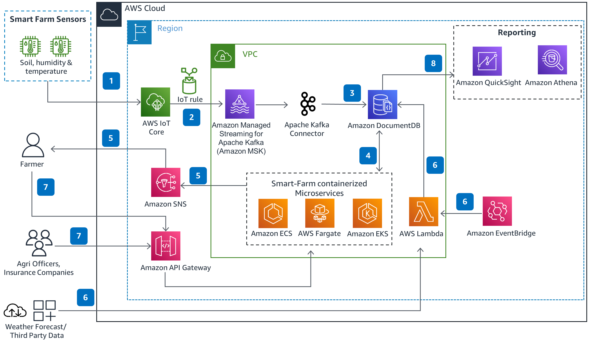

# Smart Farming Solution on AWS

## Overview

This architecture demonstrates a smart farming solution on AWS, where sensors on the farm send JSON data to AWS IoT Core for processing. The data is then forwarded to Amazon Managed Streaming for Apache Kafka (Amazon MSK) based on predefined rule conditions. The JSON data is stored in Amazon DocumentDB with MongoDB compatibility, leveraging Amazon MSK serverless and a containerized Kafka connector set up on AWS Fargate. Containerized microservices process the sensor and third-party data, generating recommendations for farmers. Notifications are sent to farmers through Amazon Simple Notification Service (Amazon SNS), and periodic data collection from third parties is automated using AWS Lambda triggered by Amazon EventBridge. Agriculture officers, insurance companies, or farmers can access additional information through the smart farm application using Amazon API Gateway. Organization admins can generate reports or perform on-demand analysis on the stored data using Amazon Athena, Amazon QuickSight, or other reporting tools.

## Architecture Components and Workflow

- **Data Ingestion**:
  - Sensors on the farm send JSON data to AWS IoT Core.

- **Data Processing and Storage**:
  - AWS IoT Core forwards data to Amazon MSK based on predefined rule conditions.
  - JSON data is stored in Amazon DocumentDB with MongoDB compatibility, utilizing Amazon MSK serverless and a containerized Kafka connector on AWS Fargate.

- **Microservices Processing**:
  - Containerized microservices process sensor and third-party data, generating recommendations for farmers.
  - Microservices can run on Amazon ECS, Fargate, or Amazon EKS.

- **Notifications**:
  - Farmers receive notifications through Amazon SNS.

- **Data Collection**:
  - AWS Lambda function periodically collects data such as weather updates and soil test results from third parties, triggered by Amazon EventBridge.

- **User Access**:
  - Agriculture officers, insurance companies, or farmers can access the smart farm application for additional information using Amazon API Gateway.

- **Reporting and Analysis**:
  - Organization admins can generate reports or perform on-demand analysis on the data stored in Amazon DocumentDB using Amazon Athena, Amazon QuickSight, or other reporting tools.

## Technologies Used

- **AWS IoT Core**: Processes and manages data from farm sensors.
- **Amazon MSK**: Handles streaming data ingestion and processing.
- **Amazon DocumentDB**: Stores JSON data with MongoDB compatibility.
- **AWS Fargate**: Runs containerized Kafka connectors and smart farm microservices.
- **Amazon ECS / Amazon EKS**: Hosts containerized microservices for data processing.
- **Amazon SNS**: Sends notifications to farmers.
- **Amazon EventBridge**: Triggers periodic data collection from third-party sources.
- **AWS Lambda**: Collects data from third parties and performs periodic tasks.
- **Amazon API Gateway**: Provides user access to the smart farm application.
- **Amazon Athena**: Performs ad-hoc analysis on stored data.
- **Amazon QuickSight**: Generates reports and visualizations for organization admins.

## Users and Use Cases

This solution caters to farmers, agriculture officers, insurance companies, and organization admins in the agriculture sector. It enables real-time data processing, smart recommendations, and easy access to information for optimized farm management and decision-making.
