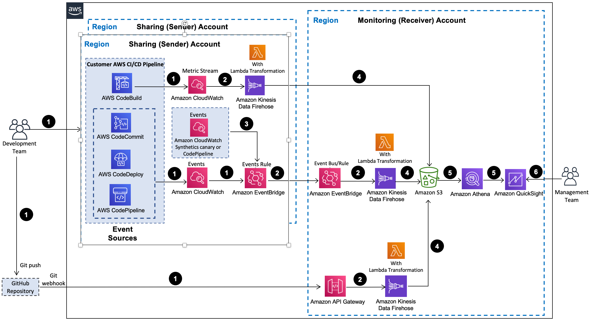

# DevOps Monitoring Dashboard on AWS

## Overview

Collecting performance and operational metrics in your continuous integration/continuous delivery (CI/CD) pipeline is crucial for measuring your return on investment in DevOps automation and identifying areas for improvement. However, aggregating, analyzing, and visualizing metrics from various components across accounts and regions can be complex and time-consuming. The DevOps Monitoring Dashboard on AWS solution automates this process by deploying resources for data ingestion, analysis, and visualization into your AWS account using a CloudFormation template.

## Example Use Cases

- **Automate Monitoring CI/CD Metrics in AWS Cloud**:
  - Automatically monitor operational metrics in your AWS CI/CD pipeline to improve software delivery processes and measure DevOps ROI.
  
- **Automate Monitoring Operational Metrics in GitHub**:
  - Stream GitHub events into a monitoring account in near real-time to track GitHub activities such as push events and calculate commits and pushes by author, repository, and branch.

- **Leverage Source Code for Customization**:
  - Utilize the solution's open-source code in GitHub to apply customizations or build your own DevOps monitoring dashboard tailored to your organization's needs.

## Features

- **Automate Near Real-Time Streaming Analytics of AWS CI/CD Metrics**:
  - Ingest and analyze operational metrics from AWS CodeCommit, CodeBuild, CodeDeploy, and CodePipeline to calculate key DevOps metrics like mean time to recovery (MTTR), change failure rate, deployment activity, build activity, pipeline activity, and code change volume.

- **Support Cross-Account Cross-Region Data Ingestion**:
  - Stream data from multiple AWS accounts and regions into a central S3 bucket in a single monitoring account for aggregation and analysis.

- **Automate Visualization with Amazon QuickSight Dashboard**:
  - Launch pre-built Amazon QuickSight dashboards to visualize CI/CD activities and gain insights without building your own dashboard.

- **Integrate with GitHub**:
  - Ingest GitHub events using an Amazon API endpoint and GitHub webhook to track and measure GitHub activities, such as push events.

- **Integration with AWS Service Catalog AppRegistry and Application Manager**:
  - Register the solution's CloudFormation template and resources as an application in AWS Service Catalog AppRegistry and Application Manager for centralized management.

## Target Audience

The DevOps Monitoring Dashboard on AWS solution is designed for IT infrastructure architects, administrators, developers, and DevOps professionals with practical experience in the AWS Cloud. It enables organizations of all sizes to track and measure the activities of their development teams, make data-driven decisions, and drive continuous improvement in their CI/CD environments.
