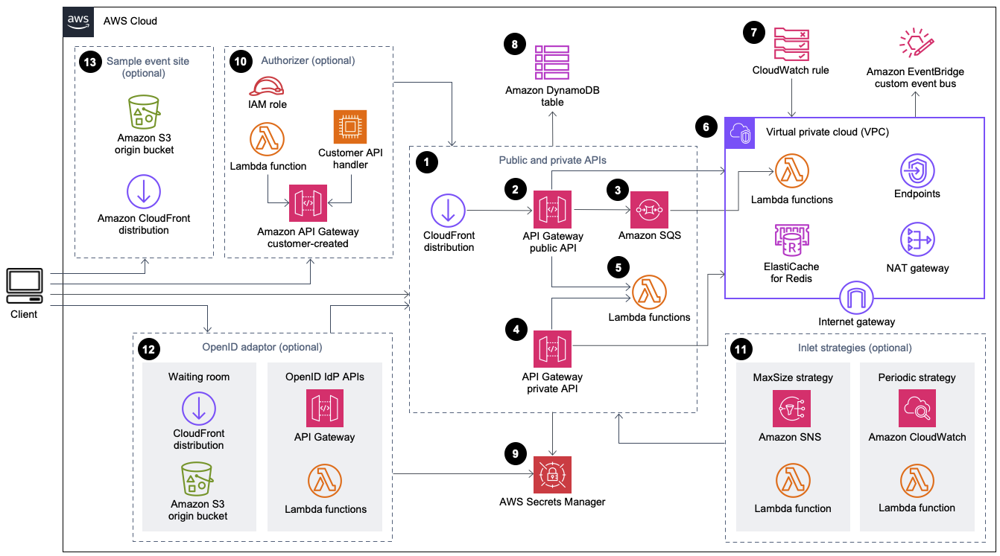

# Virtual Waiting Room on AWS

## Overview

The Virtual Waiting Room on AWS solution helps manage incoming user requests to your website during large bursts of traffic by creating a cloud infrastructure designed to temporarily offload incoming traffic and provide options to customize and integrate a virtual waiting room. It seamlessly scales to handle sudden surges in traffic and can be integrated with both new and existing websites.

### Examples of Large-Scale Events:
- Start of sale for concert or sporting event tickets
- Fire sale or other large retail sale, such as Black Friday
- New product launch with broad marketing announcements
- Exam access and class attendance for online testing and lessons
- Release of medical appointment slots
- Launch of a new direct-to-customer service that requires account creation and payments

### Key Features:
- Structured queuing of users into your website
- Scalability to control traffic for very large event sizes
- JSON web token generation to allow entry to the target site
- All functionality controlled through REST APIs
- Turnkey API Gateway authorizer for client solutions
- Standalone integration or use with OpenID

## Architecture

### Infrastructure Deployed:
- Amazon CloudFront distribution for public API calls
- Amazon API Gateway public API resources for queue management
- Amazon SQS queue to regulate traffic to processing Lambda function
- API Gateway private API resources for administrative functions
- Lambda functions for processing public and private API requests
- Amazon VPC to host Lambda functions interacting with ElastiCache for Redis
- Amazon CloudWatch rule to periodically broadcast status updates
- Amazon DynamoDB tables for storing token, queue position, and serving counter data
- AWS Secrets Manager for storing keys and sensitive data
- Optional components include authorizer, Amazon SNS, CloudWatch, Lambda functions, OpenID adaptor, and CloudFront distribution with Amazon S3 bucket

### Workflow Steps:
1. **User Enters the Waiting Room**:
   - User requests queue position through assign_queue_num API
   - Request is placed in SQS queue and assigned a unique Request ID
   - Lambda function processes queue messages, increments counter, and stores requests in ElastiCache for Redis
   - Client polls queue_num API for position
  
2. **User Waits in the Waiting Room**:
   - Client polls serving_num API for serving position
   - Once serving position >= queue position, client requests JWT from generate_token API
   - Token is generated and stored in DynamoDB
   
3. **User Leaves the Waiting Room**:
   - Client presents token to enter target site and complete transaction
   - After transaction, token status is updated in DynamoDB
   
### Queue Position Expiry:
- Feature activates expiry of Request ID for token generation after specified time interval

### Increment Serving Counter on Queue Position Expiry:
- Feature automatically increments serving counter based on expired queue positions

## Workflow
- User enters waiting room and requests queue position
- User waits in waiting room until serving position is reached
- User leaves waiting room and enters target site with JWT

## JWT Explanation

JSON Web Token (JWT) is a compact, URL-safe means of representing claims to be transferred between two parties. In the Virtual Waiting Room on AWS solution, JWTs are generated and used by clients to gain access to the target site after waiting in the virtual waiting room. 

When the client receives its token, it enters the target site to begin its transaction. Depending on how your infrastructure supports an integration with JWT, the client may need to present the token in a request header, a cookie, or another way. The authorizer for API Gateway can be used to validate the token included in a client’s request. Any commercial or open-source libraries for validating and managing JWTs can be used with Virtual Waiting Room on AWS tokens. If the token is valid, the client is allowed to continue their transaction.