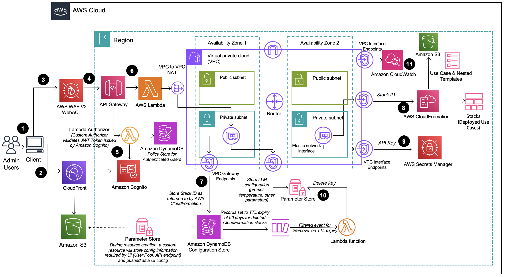

# Generative AI Application Builder on AWS

The Generative AI Application Builder on AWS facilitates the development, rapid experimentation, and deployment of generative artificial intelligence (AI) applications without requiring deep experience in AI. This AWS Solution accelerates development and streamlines experimentation by helping you ingest your business-specific data and documents, evaluate and compare the performance of large language models (LLMs), rapidly build extensible applications, and deploy those applications with an enterprise-grade architecture.

## Key Features

- Accelerated development and streamlined experimentation of generative AI applications
- Integration with Amazon Bedrock and its included LLMs, such as Amazon Titan, and LLMs deployed on Amazon SageMaker
- Pre-built connectors to external model providers such as Anthropic and Hugging Face
- Custom connections to your choice of model using LangChain or AWS Lambda
- No-code deployment wizard for building generative AI applications for conversational search, AI-generated chatbots, text generation, and text summarization

## Target Audience

This implementation guide is intended for solution architects, business decision makers, DevOps engineers, data scientists, and cloud professionals who want to implement Generative AI Application Builder on AWS in their environment.

## Architecture Diagrams

### Deployment Dashboard
- Serves as a management console for admin users to view, manage, and create their use cases
- Enables rapid experimentation, iteration, and productionization of various AI/ML workloads leveraging LLMs
- Web interface hosted in an Amazon S3 bucket and delivered via Amazon CloudFront
- APIs protected by AWS WAF with rules configured for web access control
- User authentication provided by Amazon Cognito
- Business logic for REST endpoints handled by AWS Lambda
- Configuration stored in Amazon DynamoDB
- Operational metrics collected and monitored using Amazon CloudWatch

### Text Use Case
- Provides a natural language interface using generative AI
- Integrable into new or existing applications
- Deployable through the Deployment Dashboard or independently via a provided URL

## Process Flow

1. Admin users log in to the Deployment Dashboard user interface (UI).
2. Amazon CloudFront delivers the web UI hosted in an Amazon S3 bucket.
3. AWS WAF protects the APIs from attacks.
4. The web UI leverages REST APIs exposed using Amazon API Gateway.
5. Amazon Cognito authenticates users.
6. AWS Lambda provides the business logic for the REST endpoints.
7. Amazon DynamoDB acts as a configuration store for deployment details.
8. When a new use case is created, a CloudFormation stack creation event is initiated.
9. If the deployment uses an LLM accessed outside of AWS, an API key is stored in AWS Secrets Manager.
10. LLM configuration options provided by the admin user are saved in Parameter Store.
11. Operational metrics are collected using Amazon CloudWatch.

Just a Note : AWS CloudFormation resources are created from AWS Cloud Development Kit (AWS CDK) constructs.

This is a very detailed architecture to be present in just a markdown file , do refer to for detailed explanation::
https://docs.aws.amazon.com/solutions/latest/generative-ai-application-builder-on-aws/architecture-overview.html
