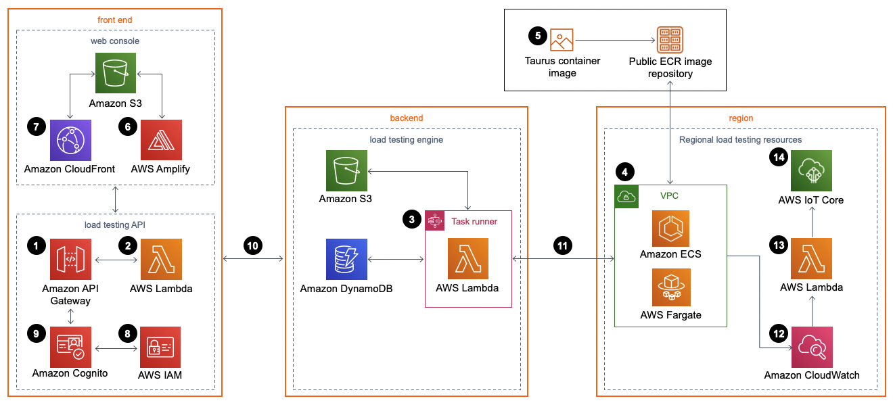

# Distributed Load Testing on AWS

Distributed Load Testing on AWS enables automated testing of software applications at scale and load, leveraging Amazon ECS on AWS Fargate for containerized simulations. It offers features like customizable testing, scheduling, and concurrent test runs, making it suitable for various use cases.

## Key Features

- **Amazon ECS on AWS Fargate**: Deploy containers independently to test software load capabilities.
- **Scalability**: Simulate thousands of connected users generating transactional records continuously.
- **Customization**: Create custom JMeter scripts for tailored application tests.
- **Scheduling**: Schedule load tests to begin automatically or on recurring dates.
- **Concurrent Testing**: Run application load tests concurrently or simultaneously.

## Target Audience

This guide caters to software developers, QA engineers, DevOps professionals, and IT administrators seeking to automate load testing using AWS infrastructure.

## Architecture Components

### Distributed Load Tester API
- Utilizes Amazon API Gateway to invoke microservices (AWS Lambda functions) for managing test data and running tests.

### Microservices
- Provides business logic for managing test data, running tests, and interacting with AWS services like Amazon S3, DynamoDB, and Step Functions.

### Amazon VPC Network Topology
- Hosts Amazon ECS containers on AWS Fargate for executing load tests.
- Utilizes Taurus load testing container image hosted on Amazon ECR.

### Web Console
- Powered by AWS Amplify and hosted on Amazon S3 for static web hosting.
- Accessed securely via Amazon CloudFront.

### Amazon Cognito User Pool
- Manages user access to the web console and Distributed Load Tester API.

### Amazon CloudWatch
- Logs test results and provides monitoring during test execution.

### AWS IoT Core
- Receives CloudWatch logs from AWS Fargate tasks during tests and publishes data for real-time monitoring in the web console.

## Use Case Suitability

Distributed Load Testing on AWS is suitable for:
- Software development teams automating load testing at scale.
- QA engineers identifying performance bottlenecks pre-release.
- DevOps professionals implementing automated testing in CI/CD pipelines.
- IT administrators managing application performance in production environments.

