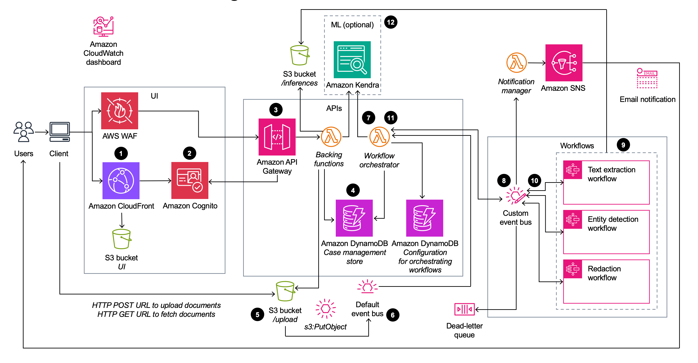

# Enhanced Document Understanding on AWS

The Enhanced Document Understanding on AWS solution automates document ingestion, analysis, detection, and redaction to improve operational efficiency and reduce costs for organizations dealing with large volumes of semi-structured and unstructured documents.

## Key Features

- **Document Ingestion Automation**: Streamlines the process of uploading and processing documents.
- **Scaleable Analysis with AI and ML**: Utilizes artificial intelligence and machine learning to analyze documents at scale.
- **Text Extraction**: Extracts text content from documents for further processing.
- **Structural Data Identification**: Identifies structural data such as tables or individual cells within tables.
- **Entity Extraction**: Extracts critical information, such as entities, from the documents.
- **Smart Search Index Creation**: Generates search indexes from the analyzed data for efficient retrieval.
- **PII and PHI Detection and Redaction**: Detects and redacts personally identifiable information (PII) and protected health information (PHI) to ensure compliance.

## Use Cases

- **Compliance**: Helps organizations meet stringent compliance requirements by automatically redacting sensitive information.
- **Operational Efficiency**: Improves operational efficiency by automating document processing tasks.
- **Insight Extraction**: Enables rapid extraction of insights from documents for informed decision making.

## Architecture Components

### Web User Interface (UI)
- Allows users to upload documents and initiate document processing workflows.

### Authentication (Amazon Cognito)
- Authenticates users accessing the web UI.

### REST Endpoint (Amazon API Gateway)
- Handles requests from the web UI and interacts with backend services.

### Case Management Store (Amazon DynamoDB)
- Stores information about uploaded documents and their processing status.

### Document Storage (Amazon S3)
- Stores uploaded documents and triggers workflow processing upon document upload events.

### Workflow Orchestrator (AWS Lambda)
- Coordinates the document processing workflows based on configured rules stored in DynamoDB.

### Event Driven Processing (Amazon EventBridge)
- Orchestrates the workflow execution based on events generated during document processing.

### State Machine Workflows (AWS Step Functions)
- Execute different stages of document processing workflows based on predefined rules.

### Metadata Indexing (Amazon Kendra - Optional)
- Indexes metadata from processed documents for efficient ML-powered search.

## Target Audience

This solution is suitable for solution architects, business decision makers, DevOps engineers, data scientists, and cloud professionals seeking to automate document processing tasks and improve operational efficiency in their organizations.
