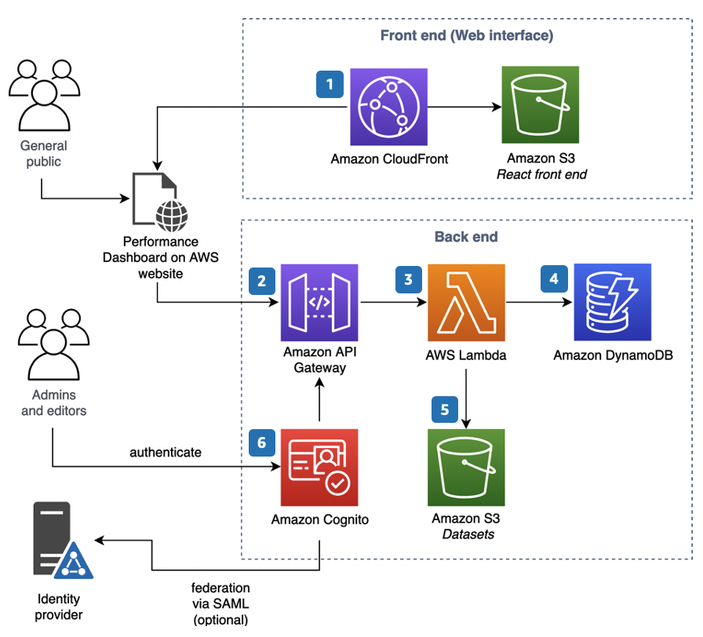

# Performance Dashboard on AWS

Performance Dashboard on AWS is an open-source dashboard management solution designed for public-sector organizations to visualize and track organizational performance easily and cost-effectively. It enables users with minimal design and analytic skills to quickly create and publish illustrative dashboards to the web.

## Key Features

- **Simple Data Presentation**: Provides a simple and cost-effective tool for visualizing data without the need for complex data visualization/analysis skills.
- **Dashboard Creation**: Users can create dashboards using various solution components such as charts, UI text, and metadata.
- **Data Sources**: Supports both static and dynamic datasets for populating dashboards, which can be uploaded individually or in bulk through the web UI or Data Ingestion REST API.

## Architecture Components

### Web Frontend (Amazon CloudFront, Amazon S3)
- Hosts and serves the web interface, including HTML pages, CSS stylesheets, JavaScript code, and digital assets associated with the solution.

### APIs (Amazon API Gateway)
- Hosts APIs called by the web frontend to access AWS Lambda functions for performing application functions.

### AWS Lambda Functions (Node.js)
- Handle and access data related to creating and serving dashboards.

### Metadata Storage (Amazon DynamoDB)
- Stores metadata about dashboards and related datasets.

### Dataset Storage (Amazon S3)
- Stores datasets used with the dashboards.

### User Identity Management (Amazon Cognito)
- Manages user identities and permissions for accessing private dashboard views.

## Deployment Process

1. Users access the web frontend hosted on Amazon CloudFront and Amazon S3.
2. The web frontend interacts with the APIs hosted on Amazon API Gateway.
3. APIs call AWS Lambda functions to perform application functions.
4. Metadata about dashboards and datasets is stored in Amazon DynamoDB.
5. Datasets are stored in Amazon S3.
6. User identities and permissions are managed by Amazon Cognito user pool.

## Target Audience

This solution is suitable for public-sector organizations that want to track and communicate organizational performance using simple and cost-effective dashboard management tools. It is also ideal for users with minimal design and analytic skills who need to create and publish illustrative dashboards quickly.
