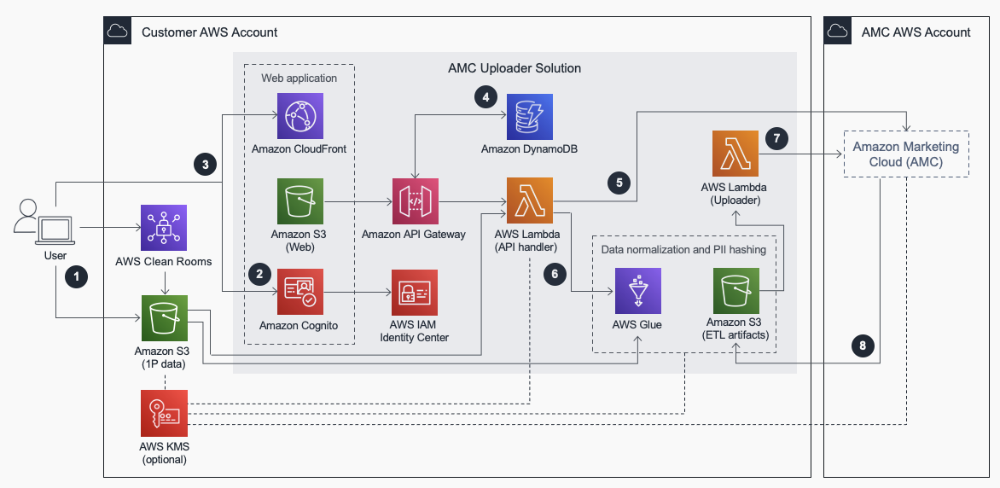

# Amazon Marketing Cloud Uploader from AWS

The Amazon Marketing Cloud Uploader from AWS is a solution designed to help Amazon Ads customers seamlessly upload customer signals into their Amazon Marketing Cloud (AMC) instance without the need for dedicated IT resources to build and support the upload workflows. It simplifies the process of uploading first-party data into AMC, allowing advertisers to optimize their Amazon Ads campaigns within AMC while maintaining complete control of their data.

## Key Features

- **Seamless Data Upload**: Facilitates the seamless upload of customer signals into AMC without the need for extensive IT resources.
- **Complete Data Control**: Ensures that advertisers maintain complete control of their data, with output data encrypted, transferred, and normalized before being uploaded into the AMC instance.
- **Integration with AWS Services**: Utilizes various AWS services such as Amazon S3, Amazon API Gateway, AWS Lambda, AWS Glue, and Amazon DynamoDB for efficient data handling and processing.

## Deployment Process

1. **Data Upload**: Users upload first-party data to a designated Amazon S3 bucket or export data from AWS Clean Rooms to the S3 bucket. Optionally, users can designate an AWS Key Management Service (KMS) key for data encryption and decryption throughout the ETL pipeline.

2. **User Authentication**: Users log in with Amazon Cognito to the provided web application to obtain authorization tokens for accessing frontend assets from Amazon S3 and backend resources from Amazon API Gateway.

3. **User Interaction**: Users interact with the provided web application through an Amazon CloudFront distribution and an API Gateway endpoint. 
    - *Amazon S3*: Stores frontend assets (HTML pages, CSS stylesheets, JavaScript code).
    - *Amazon CloudFront*: Serves static website assets from Amazon S3.
    - *Amazon API Gateway*: Provides a REST API interface to the API handler AWS Lambda resource.

4. **Configuration Storage**: Amazon DynamoDB stores system configurations, including user-specified connection details for Amazon Marketing Cloud instances. These configurations are utilized by the frontend via the API handler Lambda resource.

5. **ETL Processing**: When users submit requests to upload data, the API handler Lambda resource triggers an AWS Glue Extract, Transform, Load (ETL) job to normalize, hash, and reformat user-specified files according to the data upload rules of Amazon Marketing Cloud.
    - *AWS Lambda*: Handles API requests and triggers the AWS Glue ETL job.
    - *AWS Glue*: Performs ETL processing to transform and format the data.
  
6. **Data Transfer**: Transformed data objects are written to an ETL artifacts Amazon S3 bucket. This event initiates requests from the Uploader Lambda resource to each user-specified Amazon Marketing Cloud instance to initiate uploads of the results.

7. **Asynchronous Upload**: Each user-specified Amazon Marketing Cloud instance asynchronously uploads transformed data objects from the ETL artifacts Amazon S3 bucket, using the optionally designated AWS KMS key for decryption when needed.

## Target Audience

This solution is aimed at Amazon Ads customers with existing AMC instances who require a streamlined process for uploading customer signals into their AMC environment. It is particularly beneficial for advertisers who want to optimize their Amazon Ads campaigns within AMC without the need for dedicated IT resources to manage the upload workflows.
