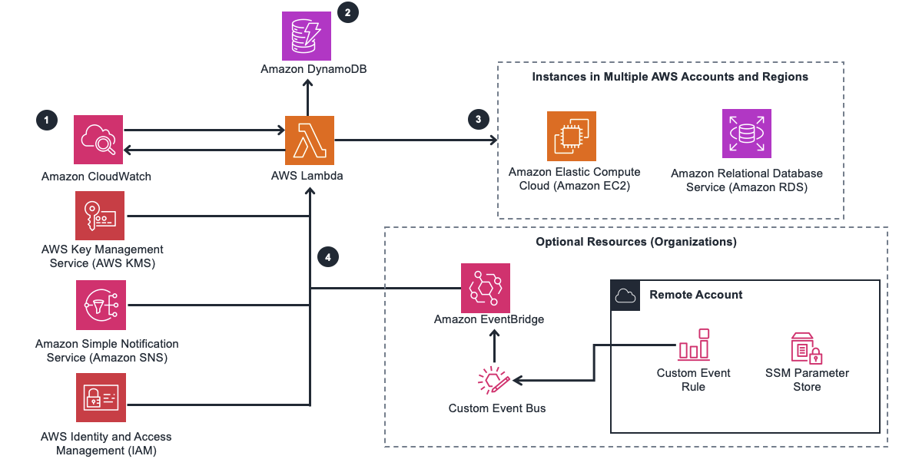

# Instance Scheduler on AWS

The Instance Scheduler on AWS solution is designed to automate the management of Amazon Elastic Compute Cloud (Amazon EC2) and Amazon Relational Database Service (Amazon RDS) instances, enabling users to optimize resource utilization and reduce operational costs through efficient scheduling.

## Overview

Managing the lifecycle of AWS instances manually can be cumbersome and inefficient, leading to unnecessary costs associated with instances running when they are not required. The Instance Scheduler solution addresses this challenge by providing a robust automation mechanism that starts and stops instances based on predefined schedules and periods.

By leveraging AWS Lambda functions, Amazon DynamoDB, and AWS CloudWatch Events, the solution offers a scalable and flexible approach to instance scheduling. Users can define schedules for individual instances or groups of instances, specifying start and stop times according to their operational requirements. This allows organizations to align instance usage with business needs, ensuring that resources are available when necessary while minimizing costs during periods of inactivity.

Key features of the Instance Scheduler solution include:

### Cross-account instance scheduling

The solution supports scheduling instances across multiple AWS accounts, enabling centralized management of instance lifecycles. By creating IAM roles and establishing trust relationships between accounts, users can delegate scheduling responsibilities while maintaining security and compliance.

### Automated tagging

Instance Scheduler automatically tags instances that it starts or stops, providing visibility into the scheduling process. Users can customize tags to include information such as schedule names, timestamps, and other relevant metadata, facilitating tracking and reporting.

### Scheduler CLI

The solution offers a command-line interface (CLI) for configuring schedules and estimating cost savings. This CLI provides a convenient way to manage scheduling tasks programmatically, streamlining the deployment and maintenance of instance schedules.

### Infrastructure as Code (IaC) support

Instance Scheduler includes CloudFormation Custom Resources for managing schedules using Infrastructure as Code (IaC) practices. This allows users to define and deploy instance schedules alongside other infrastructure components, ensuring consistency and repeatability in deployment workflows.

### Integration with SSM Maintenance Windows

For Amazon EC2 instances, Instance Scheduler can integrate with Systems Manager (SSM) maintenance windows, allowing users to coordinate instance scheduling with planned maintenance activities. This ensures that instances are started and stopped in accordance with maintenance windows, minimizing disruptions to operations.

### Integration with AWS Service Catalog AppRegistry and Application Manager

The solution integrates with AWS Service Catalog AppRegistry and Application Manager, providing a centralized repository for managing the solution's resources. By registering the solution's CloudFormation template and underlying resources as an application, users can streamline resource management and governance processes.

## Architecture

The architecture of the Instance Scheduler solution is built around the following components:

1. **Amazon CloudWatch Event**: Triggers the execution of AWS Lambda functions at specified intervals, initiating the instance scheduling process.

2. **AWS Lambda Function**: Executes the scheduling logic, retrieving configuration data from Amazon DynamoDB and starting or stopping instances based on predefined schedules and periods.

3. **Amazon DynamoDB**: Stores configuration information, including schedule definitions, instance tags, and account mappings, enabling dynamic and scalable scheduling operations.

4. **Amazon EC2 and RDS Instances**: The target instances that are started or stopped based on the defined schedules and periods, ensuring optimal resource utilization.

5. **Amazon RDS and Aurora Clusters**: In addition to EC2 instances, the solution supports scheduling of RDS instances and Aurora clusters, providing comprehensive management capabilities for AWS resources.

6. **Amazon CloudWatch Logs**: Captures logging information for monitoring and troubleshooting purposes, facilitating visibility into scheduling activities and system behavior.

7. **AWS IAM Roles**: Manages permissions for accessing and modifying AWS resources, ensuring secure and controlled execution of scheduling operations.

8. **Amazon SNS**: Sends notifications for error handling and alerting, enabling users to promptly address any issues encountered during the scheduling process.

9. **AWS KMS**: Provides encryption for sensitive data, ensuring the confidentiality and integrity of communication channels and stored information.

10. **AWS Systems Manager**: Offers operational insights and management capabilities, allowing users to monitor resource performance and automate administrative tasks.

11. **AWS EventBridge**: Facilitates event-driven communication and integration, enabling cross-account scheduling and coordination when utilizing the AWS Organizations feature.

## Target Audience

The Instance Scheduler on AWS solution is ideal for IT infrastructure architects, administrators, and DevOps professionals seeking to optimize resource utilization and reduce costs through automated instance scheduling. Whether managing a single AWS account or orchestrating scheduling operations across multiple accounts and regions, the solution provides a comprehensive and scalable approach to instance management.
