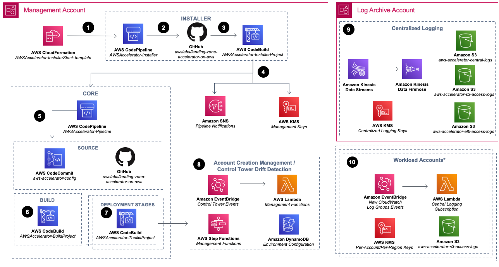

# Landing Zone Accelerator on AWS

## Overview

The Landing Zone Accelerator on AWS (LZA) is designed to align with AWS best practices and compliance frameworks to manage and govern a multi-account environment effectively. It enhances the foundational capabilities of AWS Control Tower, providing a comprehensive solution for organizations with highly-regulated workloads and complex compliance requirements. LZA is an open-source project built using the AWS Cloud Development Kit (AWS CDK), allowing customers to install it directly into their environments and access the infrastructure as code (IaC) solution.

## Key Features

- **Enhanced Landing Zone Capabilities**: Complements AWS Control Tower with additional functionality, controls, and security services across 35+ AWS services.
  
- **No Additional Charges**: There are no extra charges or upfront commitments required to use LZA. Customers only pay for the AWS services they use to set up and operate their controls.

- **Support for Non-Standard AWS Partitions**: LZA can support non-standard AWS partitions, including AWS GovCloud (US), AWS Secret, and AWS Top Secret Regions.

## High-Level Architecture

### Installation Process

- **AWS CloudFormation Template**: Installs the solution into the environment and deploys an AWS CodePipeline containing the LZA installation engine.
  
- **Installer Pipeline (AWSAccelerator-InstallerStack)**: Functions separately from the Core pipeline, enabling easy updates to future versions of the solution with a single parameter change.
  
- **AWS CodeBuild Project**: Orchestrates the building and running of the solution's AWS CDK application, deploying the Core pipeline and associated dependencies.

### Core Pipeline

- **Validation and Synthesis**: Validates and synthesizes inputs and deploys additional CloudFormation stacks with AWS CDK.
  
- **Configuration Files**: Configuration files stored in an AWS CodeCommit repository (aws-accelerator-config) are used for configuring and managing the solution.
  
- **AWS CodeBuild Project**: Compiles and validates the AWS CDK application configuration.

### Deployment Stages

- **AWS CodeBuild Deployment Stages**: Deploy resources defined in the configuration files to the multi-account environment. Includes optional manual review stage for reviewing changes.
  
- **Drift Detection and Account Enrollment**: Deploys resources to monitor AWS Control Tower lifecycle events for drift detection and automate the enrollment of new AWS accounts into the multi-account environment.

### Centralized Logging

- **Log Archive Account**: Centralized logging resources deployed in the Log Archive account, including Amazon Kinesis resources for log streaming, AWS KMS keys for encryption at rest, and Amazon S3 buckets for log storage.

## Configuration

- **Configuration Files**: Use simplified configuration files to configure additional functionality, controls, security services, and foundational networking topology.
  
- **AWS Control Tower Integration**: Ensure proper enrollment of accounts and organizational units (OUs) within AWS Control Tower for seamless integration.

## Guidance

- **For AWS Organizations Based Installation (Without AWS Control Tower)**: Provides guidance for installations not utilizing AWS Control Tower.

## Note

- **For AWS Control Tower Users**: Ensure accounts and OUs within AWS Control Tower are properly enrolled and managed through the AWS Control Tower console.

