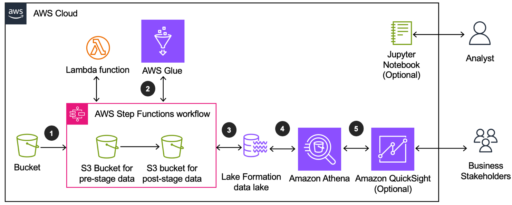

# Amazon Marketing Cloud Insights on AWS

Amazon Marketing Cloud Insights on AWS is a tool designed to assist businesses in analyzing and enhancing their advertising and marketing campaigns on Amazon Ads. Utilizing Amazon Web Services (AWS), this solution enables the storage, querying, evaluation, and visualization of data sourced from the Amazon Marketing Cloud (AMC) API.

Analysts and developers can leverage this tool to monitor the performance of their campaigns in real-time. They gain access to key metrics such as audience reach, frequency, and geographic distribution, as well as segmented data based on factors like demographics and device usage.

For instance, businesses can utilize this tool to amalgamate data from various brand campaigns on AWS, identify consumer segments with a higher likelihood of product purchase, and allocate ad spending more effectively while minimizing wasteful expenditures.

### Unique Features of Amazon Marketing Cloud Insights on AWS:

- **Reduced Development Time**: 
  - Deployment of AWS services for data storage, querying, analysis, and visualization from AMC API reports significantly reduces development time from weeks to hours.

- **Campaign Metrics Analysis**: 
  - Analysts can easily query and monitor campaign performance metrics like audience reach, frequency, and various dimensions such as geographic area, audience segment, and device.

- **Combined Campaign Reports**: 
  - Consolidate AMC API query results from multiple brand campaigns across advertising channels (video, audio, display, sponsored ads) within your AWS account for a comprehensive understanding of the customer journey.

- **Integration with AWS Services**:
  - Integration with Service Catalog AppRegistry and AWS Systems Manager Application Manager facilitates centralized management of the solution's resources. This enables easier registration of the CloudFormation template and its underlying resources as an application.

### Amazon Marketing Cloud Insights on AWS Architecture:

- **Data Pipeline Process**:
  1. Data from the customer's AMC Amazon S3 bucket is picked up and moved to a pre-stage S3 prefix in the stage S3 bucket by the solution's data lake pipeline.
  2. Transformation logic is applied to the incoming data by AWS Glue, which prepares it for analysis and stores the transformed data under a post-stage S3 prefix in the stage S3 bucket.
  3. AWS Lake Formation controls access permissions to the transformed data in the stage S3 bucket.

- **User Access and Analysis**:
  - Users can access the transformed data using Amazon Athena to perform query analysis on the stage S3 bucket.
  - Dashboards can be built in Amazon QuickSight based on Athena queries run on the stage data for visualization and insights.

  ## Architectural Details

  ### Microservices

#### Tenant Provisioning Service (TPS):
- Manages AMC customers onboarded through the solution.
- Each customer is mapped to an AMC instance and deployed as a stack in the solution.

#### Workflow Manager (WFM):
- Handles requests sent to the AMC API.
- Synchronizes data between the solution and a customer's AMC instance.
- Enables scheduling of AMC workflows using CRON-based scheduling.
- Utilizes queue-based routing to ensure all requests are processed.

#### Platform Management Notebooks (PMN):
- Provides sample code for interfacing with TPS and WFM.

### Data Lake

- Transforms data from AMC instance Amazon S3 bucket managed by WFM.
- Objects can be uploaded and copied by an external provider or AWS service to the raw Amazon S3 bucket.
- Detects created objects and initiates transformations if configured.
- Routes data to corresponding pipelines and applies custom transformations provided by customers.
- Transformed data is stored in Amazon S3 stage buckets and accessible through AWS Glue Data Catalog.

### Orchestration

- **AWS Step Functions** coordinates multiple activities in the solution.
- In TPS, Step Functions orchestrate Lambda functions to add AMC instances and register provisioned customers into the data lake.
- WFM utilizes Step Functions to coordinate Lambda functions for processing workflow requests, creating workflow runs, checking status, and user notification.
- Step Functions in the data lake automate transformations after data creation in the AMC or raw S3 bucket.

