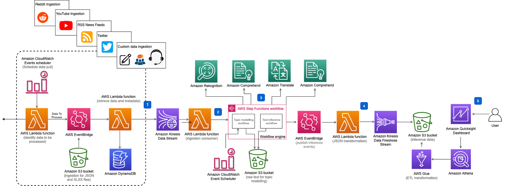
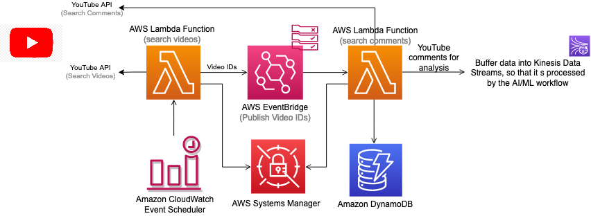
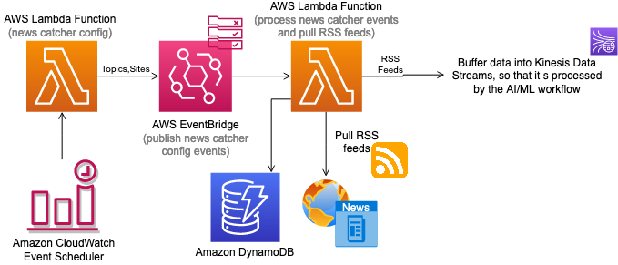
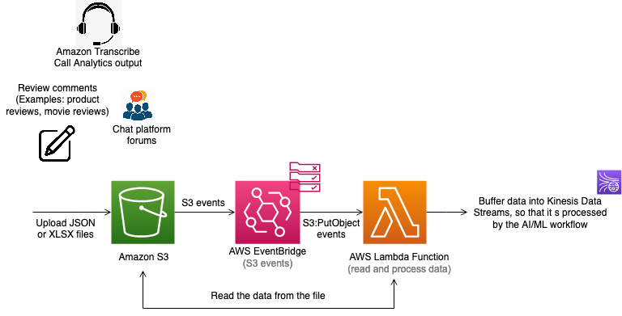

# Discovering Hot Topics Using Machine Learning Solution:

The Discovering Hot Topics Using Machine Learning solution aims to identify the most dominant topics associated with products, policies, events, and brands. By doing so, it enables businesses to react promptly to new growth opportunities, address negative brand associations, and enhance customer satisfaction levels.

#### Key Benefits:
- React quickly to new growth opportunities.
- Address negative brand associations.
- Deliver a higher level of customer satisfaction.
- Gain insights into relevant topics for the business.

#### Data Ingestion Sources:
- **RSS News Feeds**: 
  - Incorporates news feeds to gather information.
- **YouTube Comments**: 
  - Collects comments from videos to analyze user feedback.
- **Reddit Comments**: 
  - Gathers comments from subreddits of interest.
- **Custom Data (JSON or XLSX)**: 
  - Allows ingestion of custom data formats for analysis.
- **Twitter (X)**: 
  - Utilizes data from Twitter for analysis.

#### Deployment:
- The solution is deployed using an AWS CloudFormation template, automating the data ingestion process from various sources.

#### Insights:
- Helps businesses understand customer sentiments and opinions about their brand.
- Provides insights into topics relevant to the business.

This solution leverages machine learning to analyze data from diverse sources, allowing businesses to make informed decisions and stay ahead in their market.

### Solution Overview:

This solution leverages pre-trained machine learning (ML) models from Amazon Comprehend, Amazon Translate, and Amazon Rekognition to offer the following benefits:

#### 1. Detecting Dominant Topics:
- Utilizes topic modeling to identify terms collectively forming a topic, aiding in understanding dominant topics.

#### 2. Identifying Customer Sentiment:
- Employs contextual semantic search to determine the sentiment of online discussions, providing insights into customer opinions.

#### 3. Image Safety Detection:
- Uses Amazon Rekognition to identify unsafe or negative imagery associated with the brand, ensuring brand safety.

#### 4. Real-time Insights:
- Offers a visual dashboard for near real-time understanding of context, threats, and opportunities.

#### Customization and Data Aggregation:
- The solution can be customized to aggregate data from various social media platforms and internal enterprise systems.
- Default CloudFormation deployment allows custom ingestion configuration with parameters and an Amazon S3 bucket for processing Amazon Transcribe Call Analytics output.
- Customization enables ingestion from internal systems and external data sources like call center transcriptions, product reviews, movie reviews, and chat forums such as Twitch and Discord.
- Custom data in JSON or XLSX format can be uploaded to an Amazon S3 bucket created during deployment.

#### Visualization with Amazon QuickSight:
- Amazon QuickSight dashboard is included for visualizing ML inferences derived from the solution.

This solution offers businesses the ability to gain insights from diverse data sources, enabling informed decision-making and proactive response to trends and sentiments in near real-time.

### Discovering Hot Topics Using Machine Learning Solution Architecture:

The solution architecture is automated by an AWS CloudFormation template, deploying various AWS services:

- **AWS Lambda functions**
- **Amazon S3 buckets**
- **Amazon Kinesis Data Streams**
- **Amazon SQS dead-letter queue (DLQ)**
- **Amazon Data Firehose**
- **AWS Step Functions workflows**
- **AWS Glue tables**
- **Amazon QuickSight resources**

#### Key Components and Workflows:

1. **Ingestion**:
   - Social media and RSS feed ingestion managed by Lambda functions, Amazon DynamoDB, and Amazon EventBridge.
   - Different ingestion architectures for YouTube comments, RSS news feeds, custom data in JSON or XLSX files, and comments from Subreddits.
  
2. **Data Stream**:
   - Data is buffered through Amazon Kinesis Data Streams for resilience and throttling, with a configured DLQ to catch processing errors.

3. **Workflow**:
   - Step Functions workflow orchestrates Amazon ML capabilities (Translate, Comprehend, Rekognition) initiated by the Data Streams consumer Lambda function.

4. **Integration**:
   - Inference data integrates with storage components via event-driven architecture using Amazon EventBridge, allowing customization by configuring rules.

5. **Storage and Visualization**:
   - Utilizes Amazon Firehose, Amazon S3 buckets, AWS Glue tables, Amazon Athena, and Amazon QuickSight for storage and visualization of data.

#### Reference Architecture Diagrams:

- Ingesting YouTube comments using the YouTube Data API
- Ingesting RSS news feeds
- Ingesting custom data in JSON or XLSX files uploaded to an S3 bucket
- Ingesting comments from Subreddits of interest

The ingestion adapters' resources are created and deployed based on selected choices during the CloudFormation template deployment.

# Discovering Hot Topics Using Machine Learning Solution

## Overview

The Discovering Hot Topics Using Machine Learning solution provides a framework for identifying dominant topics associated with products, events, and brands. By leveraging pre-trained machine learning models from Amazon Comprehend, Amazon Translate, and Amazon Rekognition, this solution helps businesses react quickly to new growth opportunities, address negative brand associations, and enhance customer satisfaction levels.

## Ingestion Methods

### 1. Ingesting YouTube Comments using the YouTube Data API:

   - **Process**: 
     - Utilizes the YouTube Data API to fetch comments associated with specific videos.
     - AWS Lambda functions are deployed to interact with the API, retrieve comments, and store them in designated storage.
   - **Use Case**: 
     - This method is ideal for businesses or content creators who want to analyze user feedback and sentiment on their YouTube videos.

### 2. Ingesting RSS News Feeds:

   - **Process**: 
     - Parses RSS feeds to extract news articles and their associated metadata.
     - Lambda functions manage the ingestion process, fetching data from RSS feeds and storing it for analysis.
   - **Use Case**: 
     - Suitable for news organizations or companies interested in monitoring and analyzing trends in news articles and headlines.

### 3. Ingesting Custom Data in JSON or XLSX Files Uploaded to an S3 Bucket:
   - **Process**: 
     - Allows users to upload custom data files (in JSON or XLSX format) to an S3 bucket.
     - Lambda functions process the uploaded files, extracting relevant data for analysis and storing it in the appropriate storage.
   - **Use Case**: 
     - Useful for businesses with proprietary data sources or custom datasets they want to analyze alongside other data sources.

### 4. Ingesting Comments from Subreddits of Interest:

   - **Process**: 
     - Retrieves comments from specific subreddits on Reddit.
     - Lambda functions are used to interact with the Reddit API, fetch comments, and store them for further analysis.
   - **Use Case**: 
     - Beneficial for companies wanting to monitor discussions and sentiments related to their brand or industry on Reddit.

## Use Cases for Reference Architecture

The reference architecture must be used for the following use cases:

1. **Social Media Monitoring and Analysis**
2. **News Monitoring and Trend Analysis**
3. **Custom Data Analysis**
4. **Brand Reputation Management**
5. **Market Research and Consumer Insights**
6. **Content Optimization**

## Deployment

The solution can be deployed using the provided AWS CloudFormation template. Follow the instructions in the deployment guide for seamless deployment of the solution components.
