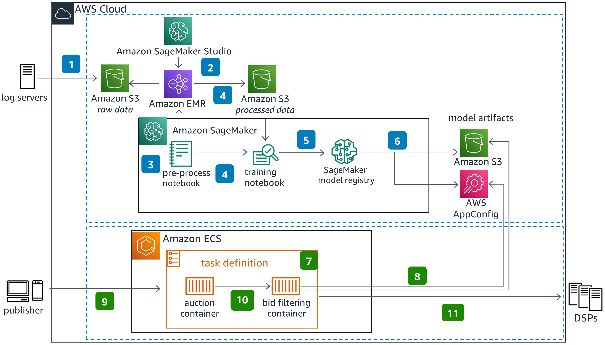

# Machine Learning for Near Real-Time Advertising on AWS

## Overview

"AdTech users" refer to individuals or companies working in the advertising technology industry. These are professionals or organizations involved in the development, deployment, and management of technologies used for advertising purposes.

"Real-time advertising auctions" are a fundamental aspect of digital advertising. In these auctions, advertisers bid in real-time for the opportunity to display their ads to users. These auctions occur within milliseconds as web pages load or as users engage with digital content. The bidding process is often automated and relies on algorithms to determine bid amounts based on various factors such as audience demographics, ad relevance, and available budget.

In the provided architecture, AdTech users and companies involved in real-time advertising auctions can benefit from leveraging machine learning models to enhance the efficiency and effectiveness of their ad bidding processes. By employing technologies like Amazon SageMaker, Amazon EMR, and Amazon ECS, these users can preprocess and analyze large volumes of advertising data, train machine learning models to predict bidding behavior, and deploy these models in real-time to make informed bidding decisions during ad auctions. This enables them to optimize their ad spend, target relevant audiences more effectively, and ultimately improve the performance of their advertising campaigns.

## Key Components and Steps

1. **Data Collection**:
   - Raw OpenRTB log data is stored in an Amazon S3 bucket.

2. **Preprocessing with Amazon EMR**:
   - Amazon SageMaker Studio deploys an Amazon EMR cluster to process raw OpenRTB data.
   - Data is transformed using EMR and stored in another S3 bucket.

3. **Model Training with SageMaker**:
   - SageMaker Pipelines triggers pre-processing and training steps.
   - ML training job utilizes pre-processed data and outputs trained models to the SageMaker model registry.
   - The trained model version is registered, saved to an S3 bucket, and metadata is stored in AWS AppConfig.

4. **Deployment of Ad Auction Server and Bid Filtering Applications**:
   - Ad auction server and bid filtering applications are deployed to Amazon ECS as individual containers.
   - Bid filtering application pulls the latest model version from the model registry and downloads the model from Amazon S3.

5. **Auction Process**:
   - Publishers initiate auction requests to the ad auction server.
   - Auction server calls the bid filter, which predicts demand side platforms' likelihood of bidding.
   - Bids below the threshold are filtered, reducing associated data transfer costs.

## Technologies Used

- **Amazon S3**: Primary data storage for raw OpenRTB log data.
- **Amazon EMR**: Utilized for data processing and transformation.
- **Amazon SageMaker Studio and Pipelines**: Facilitates ML model training and preprocessing steps.
- **AWS AppConfig**: Stores metadata for trained models.
- **Amazon ECS**: Hosts ad auction server and bid filtering applications as containers.

## Suitable Users

This architecture is ideal for AdTech users and companies involved in real-time advertising auctions. It enables optimization of bid decisions by predicting demand side platforms' likelihood of bidding, reducing data transfer costs, and enhancing overall auction efficiency.
