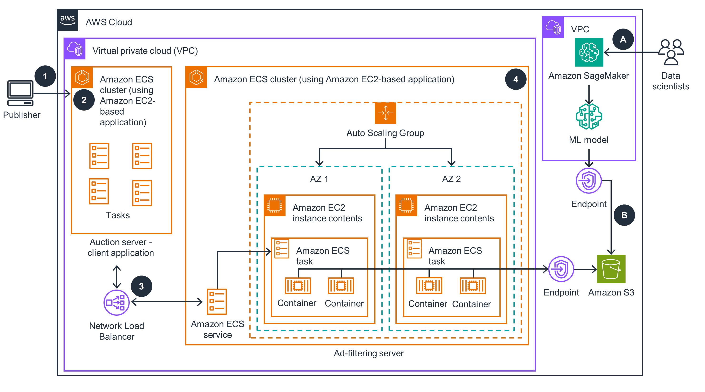

# Real-Time Machine Learning Inference for Advertising on AWS

## Overview

This guidance demonstrates how to build a real-time machine learning (ML) inferencing solution on AWS capable of handling millions of requests per second. By hosting the ML model on Amazon Elastic Container Service (Amazon ECS) and routing requests through Network Load Balancer, low latency and high-throughput inference can be achieved, ideal for real-time and programmatic advertising scenarios. The example focuses on using ML for ad request filtering and includes building a client application for simulating high-throughput OpenRTB-based requests.

## Roles Involved

### Data Scientist
- Uses Amazon SageMaker to experiment, build, and train the ML model.
- Once the model is ready, it's saved in Amazon S3.

### Publisher
- Issues requests to a supply-side platform (SSP) auction server for ad placement.
- The auction server (client application) is hosted on Amazon ECS within the SSP's VPC.
- Auction requests are based on the OpenRTB format.

## Architecture Components and Workflow

- **ML Model Hosting**:
  - Trained ML model is loaded by an Amazon ECS task hosted as a Thrift endpoint.
  - Incoming requests in OpenRTB format are used for inference.

- **Request Routing**:
  - Network Load Balancer distributes incoming requests to an Amazon EC2-based Amazon ECS cluster hosting the ad-filtering ML server.
  - ML server infers the likelihood of a bid for each request, filters demand partners, and optimizes bidding costs.

- **Ad-Filtering ML Server**:
  - Hosted as a container within an Amazon EC2-based Amazon ECS cluster.
  - Amazon EC2 Auto Scaling group maintains desired EC2 instances for high availability.
  - Amazon ECS deploys and manages the desired capacity of ML tasks, each loading the model from an Amazon S3 bucket and hosting it as a Thrift endpoint.

## Technologies Used

- **Amazon SageMaker**: For ML model experimentation, building, and training.
- **Amazon ECS**: Hosts the ML model inference tasks and auction server.
- **Amazon S3**: Stores trained ML models.
- **Network Load Balancer**: Routes incoming requests to the ECS cluster.
- **Amazon EC2**: Provides compute resources for hosting ECS tasks.
- **Amazon EC2 Auto Scaling**: Ensures high availability by maintaining desired EC2 instances.
- **Thrift Protocol**: Used for communication between ML model endpoints and clients.

## Suitable Users

This architecture is suitable for companies and developers working in the advertising technology sector, particularly those involved in real-time bidding and programmatic advertising. It provides a scalable and efficient solution for handling high-throughput inference requests in real-time ad auction scenarios.
